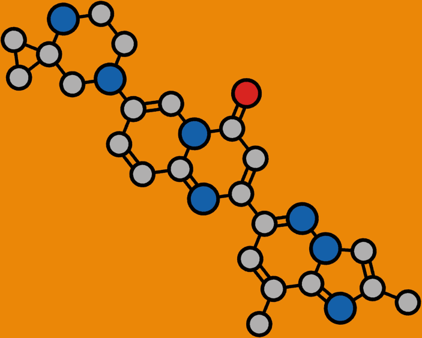

# AI/ML Portfolio
---
## Deep learning

### RNA small molecule prediction

• A deep learning model for predictions of RNA small molecules.
• This is an LSTM – GRU model which is a sequence to sequence model .
• Later this deep learning model was used for all the RNA sequences .

---
### HERG toxicity model

• A machine learning model which predicts if the molecule is herg toxic or not.
• This is a classification model used for predicting toxic or intoxic.
• Used Deep Neural Networks for these predictions.
• Later these models were used for predicting of toxic and intoxic molecules.
• Performed similarity maps where it predicts the toxicity of every part of a 
 molecule.

---
### Attention Transformer

• Designed a single neural network architecture that performs competitively 
 across a range of molecule property prediction.
• Developed this deep learning model for prediction of properties of 
molecules
• This deep learning model was further used for the machine learning models 
 developed.

---
### Deep Docking

• A deep learning model for augmentation of structure based drug discovery.
• Developed this model to predict the docking score for molecules.
• Libraries used are tensorflow, keras, rdkit and sci-kit learn.

##Machine Learning
---
### Half- life Prediction

• Performed data analytics and visualization for human and rat half-life data.
• Predicted machine learning models and performed similarity maps for low 
and  high half-life data.

---
### Triple Re-uptake models

• A machine learning model which predicts if the molecule is active or inactive
• This is a classification model used for predicting active or inactive.
• Triple re-uptake has three sets of data SERT, NET and DAT.
• Used XG boost classifier model for these predictions.
• Later these models were used for predicting of active and inactive 
molecules

---
### HERG toxicity model

• A machine learning model which predicts if the molecule is herg toxic or not.
• This is a classification model used for predicting toxic or intoxic.
• Used Deep Neural Networks for these predictions.
• Later these models were used for predicting of toxic and intoxic molecules.
• Performed similarity maps where it predicts the toxicity of every part of a 
 molecule.

---
### Blood Brain Barrier Permeability

• Developed a machine learning model to predict Blood Brain Barrier 
 Permeability using various classification algorithms and observed best 
model by  Extreme Gradient Boosting (XG boost) Algorithm.
• Performed data pre-processing on the dataset gathered from various 
 publications.
• Analyzed data using rdkit, numpy, pandas and seaborn

---
### Solubility Prediction tool

• supported in development of a machine learning models to predict and 
assess  compound solubility and decision making using multiple regression 
and  classification algorithms and further validated using externaldataset
• Performed data pre-processing on the dataset gathered from various 
 publications.
• Analysed data using rdkit, numpy, pandas and seaborn.

